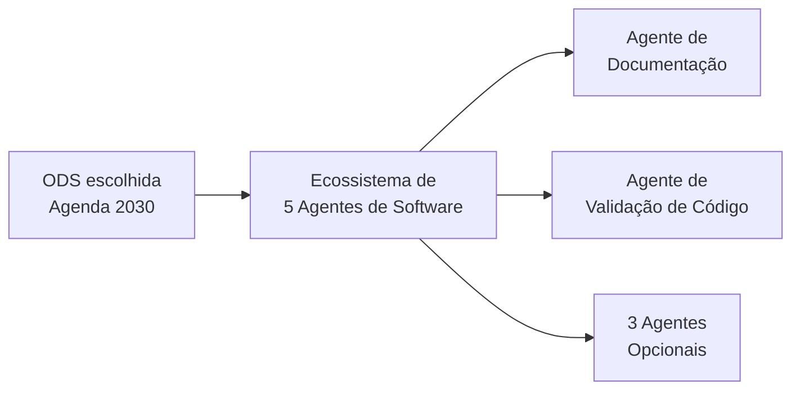
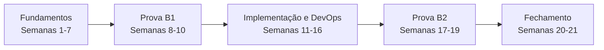

# Tecnologias Emergentes em Engenharia de Software

## Boas-vindas & Contrato de Convivência

Prof. Pedro Satin
8º Semestre - Engenharia de Software

---

## Quem é o Prof. Pedro Satin?

* Sou formado em Engenharia de Software aqui na UniCesumar (2017-2021) e depois fiz pós em Desenvolvimento Frontend na Anhanguera.
* Comecei a mexer com computador aos 7 anos, xeretando a máquina de trabalho da minha mãe. Viciei e nunca mais parei.
* Hoje sou apaixonado pelo ecossistema **JavaScript/TypeScript** e por construir web que funciona pra todo mundo, acessibilidade incluída.

---

## Trajetória Profissional

* Hoje sou Software Engineer na **Saúde Bliss**, mexendo com React, TypeScript, Node.js e AWS pra deixar o mundo dos planos de saúde um pouco mais inteligente.
* Antes disso passei pelo **Inter**, no time do Intershop, como Frontend Engineer: Next.js, micro-frontends, observabilidade em produção (New Relic, Grafana, OpenSearch).
* Tive também uma passagem pela **Claranet** como Fullstack, cuidando de monitoramento de nuvem gerenciada.
* E antes de tudo isso, fui Dev Full Stack aqui na própria **UniCesumar**, no **Studeo**, a plataforma que vocês usam todo dia. Sim, já fui vítima dos bugs dela também.

---

## Projetos Pessoais (Mão na Massa)

Fora da sala de aula eu também gosto de botar a mão na massa. Alguns exemplos recentes:

* **Palpitae** (palpitae.com.br): bolão completo pra Copa 2026. React (Vite) no Cloudflare Pages, API em Hono nos Workers, banco D1 (SQLite), login com Google.
* **Bolão Brasileirão:** um MVP mais simples, sem autenticação, puxando dados do Brasileirão em tempo real.
* **Google Health Dashboard:** painel de sono e atividade física a partir do export do Google Health/Fitbit. Python pra consolidar os dados, deploy com `wrangler` no Cloudflare Pages, acesso trancado via Cloudflare Access.

---

## Dados da Disciplina

Pra quem quer se localizar:

* **Nome:** Tecnologias Emergentes em Engenharia de Software (a antiga *Tópicos Especiais*)
* **Carga horária:** 80h, metade teórica e metade prática
* **Material:** slides em MARP viram PDF, código-fonte fica no GitHub
* **Turmas:** A na quarta, B na quinta

---

## Nova Ementa: Foco em "AI Engineering"

> Estudo e aplicação prática de tecnologias emergentes com ênfase em **Engenharia de Inteligência Artificial**: LLMs, engenharia de prompt, arquiteturas multiagente, padrões GoF/GRASP, CI/CD aplicado a fluxos cognitivos, testes de sistemas não-determinísticos e sustentabilidade computacional (ODS/Agenda 2030).

Bonito no papel, né? Vamos deixar isso concreto: tudo o que vier daqui pra frente serve pra construir **um projeto real**, o ecossistema de agentes de vocês.

---

## O Contrato Social da Nossa Turma

Vocês são formandos, praticamente engenheiros de mercado. Então vou tratar vocês assim: com **maturidade extrema**.

* Não quer assistir aula, prefere codar outra coisa ou até sair da sala? Tudo bem, eu não vou ficar policiando.
* Só tem uma regra que não abro mão: não atrapalhe quem quer aprender.
* E o combinado é justo dos dois lados: a liberdade é sua, a responsabilidade pela nota também.

---

## Como Vamos Trabalhar

* Dúvida pontual? Pode perguntar na hora. Se for algo mais complexo, seguro pros **últimos 15-20min** da aula, pra não travar o fluxo de quem tá acompanhando.
* Slides sempre em **MARP** (`.md` + `.pdf`), disponíveis no GitHub.
* Nas semanas de prova, jogo tudo consolidado no **AVA/Studeo**.

---

## IA na Engenharia de Software: Alavanca ou Muleta?

> "Quem não quer aprender também consegue tirar nota hoje usando IA. Mas se vocês quiserem se destacar, precisam usar LLMs pra aprender - não pra emburrecer."

* Quem só copia e cola código gerado por IA é fácil de substituir. Essa carreira dura pouco.
* Quem vira **engenheiro AI-Native** usa a IA pra acelerar o chato (teste, doc, refactor), mas continua sendo quem decide arquitetura e o que realmente importa.

---

## A AEP: Ecossistema de Agentes de Software



* Dois agentes são obrigatórios pra todo mundo: Documentação de Software e Validação de Código.
* Os outros três vocês escolhem: Arquiteto, Gestão de Projeto, Testes, Segurança, Sustentabilidade, Onboarding ou Acessibilidade.

---

## AEP: Entrega 1 vs. Entrega 2

Dois bimestres, dois momentos bem diferentes:

| | **Entrega 1** (Bimestre 1) | **Entrega 2** (Bimestre 2) |
|---|---|---|
| Foco | Concepção conceitual | Implementação e testes |
| Entregável | Especificação em PDF | Protótipo funcional |
| Exige | GoF/GRASP, estilo arquitetural, diagramas Mermaid | Mín. 5 testes/agente, métricas (acerto, latência, falsos pos/neg) |
| Rigor | Justificativa técnica | Estatística: média, mediana, desvio padrão |

---

## Cronograma Geral do Semestre



* **Fundamentos:** prompt engineering, arquiteturas, GoF/GRASP
* **Provas B1/B2:** revisão (talvez), prova teórica, feedback
* **Implementação:** APIs assíncronas, Git Hooks, CI/CD, testes, estatística
* **Fechamento:** substitutiva e encerramento letivo

---

## Infraestrutura da Disciplina - Zero Custo

Ninguém aqui precisa tirar dinheiro do bolso pra acompanhar a disciplina:

* **Stack sugerida:** TypeScript / Node.js, o que já conecta direto com o mercado de agentes e automação.
* **APIs gratuitas pra usar sem medo:**
  * Google AI Studio, com Gemini 1.5 Flash num nível grátis bem generoso
  * Groq Cloud, rodando Llama 3 e Mixtral
  * Ollama ou LM Studio, se preferir rodar localmente sem depender de nuvem

---

## "Consórcios" de Assinatura

* Se quiserem, times de 3-5 pessoas podem se juntar pra dividir o custo de ferramentas pagas (Claude Code, Cursor, Codex, Antigravity). Minha sugestão: aproveitem os times que já formaram na Escola de TI.
* Isso não muda a entrega, que continua individual por equipe. O consórcio é só sobre a assinatura - e se preferirem pagar sozinhos, sem problema nenhum.
* A ideia aqui é simples: dá pra usar bons modelos e elevar o nível de automação sem pesar no bolso de ninguém.

---

## Próximo Passo: Questionário Diagnóstico

* Uso as respostas de vocês pra planejar as próximas aulas de **nivelamento técnico** - então quanto mais sincero, melhor pra todo mundo.
* Pergunto sobre a stack da Escola de TI, como vocês se avaliam tecnicamente, quanto já usam IA no dia a dia e quais dores reais vocês têm em desenvolvimento.
* Link no chat/quadro. **Preencham agora**, enquanto tá fresco.

https://forms.gle/ToX6nQjaszC3qvZy6

---

## Bibliografia da disciplina

* PRESSMAN & MAXIM, *Engenharia de Software: uma abordagem profissional*: ciclo de vida, qualidade, gerência de configuração.
* GAMMA et al., *Padrões de Projeto* (o "GoF"): Factory, Strategy, Adapter e Observer na fonte original.
* LARMAN, *Utilizando UML e Padrões*: é daqui que vem o GRASP.
* BASS, CLEMENTS & KAZMAN, *Software Architecture in Practice*: estilos arquiteturais e trade-off.
* HUYEN, *AI Engineering* (O'Reilly, 2025), [huyenchip.com/books](https://huyenchip.com/books/): o mais próximo de um livro-texto do que fazemos aqui.

---

## Onde acompanhar o assunto

* [refactoring.guru/pt-br](https://refactoring.guru/pt-br/design-patterns): padrões GoF com exemplo, diagrama e código, em português.
* [martinfowler.com/architecture](https://martinfowler.com/architecture/): arquitetura, eventos, microsserviços.
* [anthropic.com/engineering](https://www.anthropic.com/engineering) e [simonwillison.net](https://simonwillison.net): prática de agente, quase toda semana com coisa nova.
* [dora.dev/dora-report-2025](https://dora.dev/dora-report-2025/): pesquisa com ~5.000 profissionais sobre IA no desenvolvimento.
* Doc oficial ganha de tutorial de blog: [ai.google.dev](https://ai.google.dev), [docs.claude.com](https://docs.claude.com), [platform.openai.com/docs](https://platform.openai.com/docs).

---

# Engenharia de prompt 

# & 

# Gestão de contexto


---

## Anatomia de um prompt: system vs user

* O **system prompt** carrega o que não muda a cada chamada: quem o agente é, como ele deve se comportar, em que formato tem que responder.
* O **user prompt** é a parte variável: o código, a pergunta, o dado que precisa ser processado agora.
* Separar os dois é o que permite reaproveitar o mesmo agente em mil situações sem reescrever a lógica toda vez.

```typescript
const systemPrompt = `Você é um revisor de código sênior.
Responda sempre em JSON, sem texto fora do objeto.`;

const userPrompt = `Revise este trecho:\n${code}`;
```

---

## Prompt ruim vs. prompt bom

Testa esses dois com o mesmo modelo e compara o resultado:

| Prompt ruim | Prompt bom |
|---|---|
| "Revisa esse código" | Papel definido no system prompt + código no user prompt |
| Não diz o que "revisar" significa aqui | Critérios explícitos: performance, segurança, legibilidade |
| Resposta em texto solto | Resposta em JSON estruturado, fácil de plugar num pipeline |

Prompt vago = saída inconsistente = automação quebrada.

---

## Few-shot prompting

Antes de pedir pro modelo fazer algo novo, mostre exemplos de como você espera que ele faça.

```typescript
const prompt = `
Exemplo 1:
Entrada: "função soma dois números"
Saída: { "nome": "sum", "params": ["a", "b"] }

Exemplo 2:
Entrada: "função que valida email"
Saída: { "nome": "validateEmail", "params": ["email"] }

Agora sua vez:
Entrada: "${userInput}"
Saída:`;
```

Poucos exemplos bons valem mais que um parágrafo inteiro de instrução.

---

## Chain-of-thought prompting

Pra tarefas que exigem raciocínio (não só geração de texto), peça pro modelo pensar em voz alta antes de responder.

* "Explique seu raciocínio passo a passo antes de dar a resposta final."
* Funciona bem pra: decisão de arquitetura, debugging, análise de trade-off.
* Força o modelo a não pular direto pra conclusão.
* Origem: WEI et al., 2022, mostraram ganho grande em problema de múltiplos passos só pedindo o raciocínio explícito.

---

## JSON mode: saída estruturada

Se a saída do agente vai alimentar outro pedaço de código (o caso normal na AEP de vocês), texto livre não serve. Vocês precisam de JSON garantido.

```typescript
const response = await model.generateContent({
  contents: [{ role: "user", parts: [{ text: prompt }] }],
  generationConfig: { responseMimeType: "application/json" },
});
```

A própria API garante o formato. Você não depende de o modelo "se comportar bem".

---

## Janela de contexto: o que é, por que estoura

* Todo modelo tem um limite de **tokens** que ele consegue processar de uma vez, prompt + resposta juntos.
* Mandar o repositório inteiro numa pergunta simples estoura esse limite rápido, e ainda custa caro (você paga por token de entrada).
* Contexto grande demais também piora a qualidade da resposta: o modelo "se perde" entre informação relevante e ruído.
* Isso já foi medido: a Chroma testou 18 modelos de ponta em 2025 e todos perderam acerto conforme a entrada crescia, mesmo em tarefa simples de recuperar um trecho.

---

## Usando `@` para referenciar arquivos

No Copilot, Cursor e ferramentas parecidas, usar `@` seguido do nome do arquivo ou pasta manda só o conteúdo relevante pro modelo, em vez de colar tudo manualmente no chat.

* Peça uma alteração específica referenciando o arquivo exato, não "olha meu projeto inteiro".
* Prefira apontar pra função/trecho isolado quando possível.
* Mesmo raciocínio de um bom code review: contexto cirúrgico gera resposta melhor, e ainda economiza token.

---

## Economia de tokens

* Referência cirúrgica (`@arquivo`, escopo de método) em vez de colar o repositório inteiro.
* Resuma histórico de conversa longa antes de continuar, senão o contexto cresce sem controle.
* Cacheie resposta de prompt repetido. Mesma pergunta duas vezes, cobrança duas vezes.
* Token de entrada e token de saída têm preço diferente, e o preço muda por modelo. Conferir a tabela do provedor antes de estimar custo faz parte do trabalho.

---

## Medindo o custo de uma chamada

* Custo = (tokens de entrada x preço de entrada) + (tokens de saída x preço de saída).
* Não precisa contar token na mão: a própria resposta da API traz a contagem.

```typescript
const res = await model.generateContent(prompt)
const uso = res.response.usageMetadata
console.log(uso.promptTokenCount, uso.candidatesTokenCount)
```

* Logar esses dois números em toda chamada já dá a base de dados de custo e latência que a Entrega 2 pede em média e desvio padrão.

---

## Para estudar mais: prompt e contexto

* Doc oficial, que fica atualizada: [platform.claude.com/docs](https://platform.claude.com/docs/en/build-with-claude/prompt-engineering/overview) e [ai.google.dev](https://ai.google.dev/gemini-api/docs/prompting-strategies).
* WEI et al., 2022, *Chain-of-Thought Prompting*, [arxiv.org/abs/2201.11903](https://arxiv.org/abs/2201.11903): paper que originou a técnica.
* LIU et al., 2023, *Lost in the Middle*, [arxiv.org/abs/2307.03172](https://arxiv.org/abs/2307.03172): mede a perda de informação no meio do contexto.
* Chroma, 2025, *Context Rot*, [research.trychroma.com/context-rot](https://research.trychroma.com/context-rot): mesma medição refeita em modelos mais atuais.
* Anthropic, *Effective context engineering for AI agents*, [anthropic.com/engineering](https://www.anthropic.com/engineering/effective-context-engineering-for-ai-agents).
