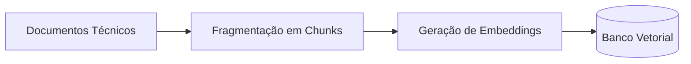
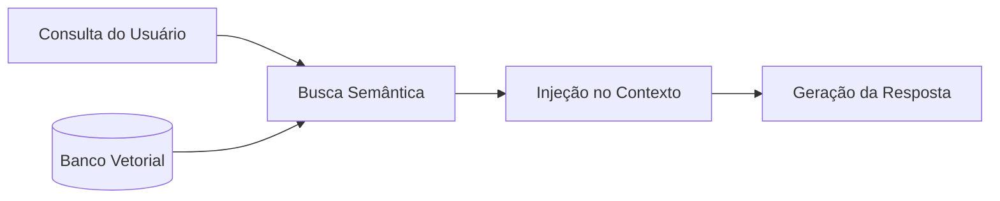
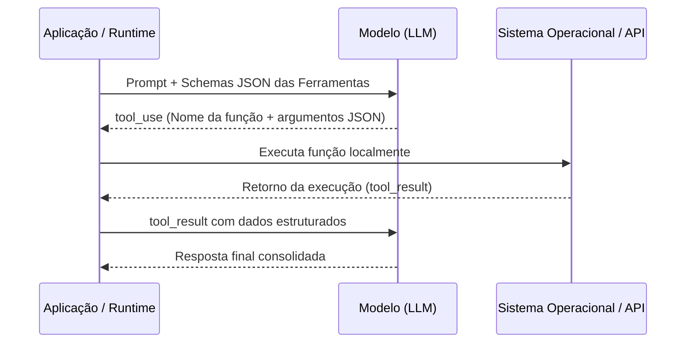

# Engenharia de agentes
## Skills, rules e tool calling

---

## Instruções estruturadas para agentes

* System prompts, exemplos few-shot e saídas estruturadas em JSON definem o comportamento do modelo em uma chamada.
* Para padronizar tarefas recorrentes em múltiplos projetos, essas instruções são organizadas em **regras** (Rules) e **habilidades** (Skills).
* O desacoplamento de instruções facilita a manutenção e o versionamento do comportamento do agente.

---

## Estrutura de uma skill

```markdown
---
name: code-review
description: Revisa código TypeScript aplicando checklist de qualidade e segurança. Ativa em revisões de PR.
---

Diretrizes de revisão:
1. Identifique potenciais falhas de segurança e injeção de código.
2. Verifique a clareza de nomenclatura e a tipagem estática.
3. Forneça o trecho corrigido para cada apontamento.
```

O campo `description` orienta o agente a selecionar a skill quando o contexto da tarefa demandar essa capacidade.

---

## Regras permanentes de repositório

* Arquivos de regras fixam diretrizes invariantes para qualquer sessão do agente no repositório.
* O conteúdo é injetado no contexto inicial do modelo automaticamente, sem necessidade de ativação sob demanda.
* Padrões conhecidos de mercado incluem `AGENTS.md`, `CLAUDE.md`, `.cursorrules` e `.github/copilot-instructions.md`.
* Definem restrições de arquitetura, padrões de formatação, convenções de commit e regras de segurança.

---

## Exemplo de regra (AGENTS.md)

```markdown
# Diretrizes do Projeto

- Stack: Node.js 24, TypeScript funcional estrito.
- Padrão de código: sem ponto e vírgula no final de linha.
- Testes: Jest para validação de endpoints e schemas.
- Restrição: proibido instalar dependências externas sem aprovação.
```

O agente lê essas regras antes de processar o primeiro pedido do usuário.

---

## Comparativo: regras, skills e prompts

| Critério | Prompt avulso | Skill | Regra (Rule) |
|---|---|---|---|
| Armazenamento | Histórico da conversa | Arquivo de skill | Arquivo de configuração |
| Ativação | Digitação manual | Sob demanda por contexto | Automática na inicialização |
| Escopo | Instrução imediata | Categoria de tarefa | Repositório inteiro |

Regras definem limites invariantes do projeto. Skills fornecem procedimentos especializados para tarefas específicas.

---

## Memória e persistência entre sessões

* Regras e skills estabelecem comportamentos padronizados, mas não preservam o histórico de decisões entre sessões isoladas.
* Ferramentas de memória persistente gravam resumos e decisões em arquivos versionados no repositório.
* A cada nova sessão, o resumo é carregado no contexto inicial, mantendo o histórico de passos anteriores.

---

## Fluxo de memória persistente


* Cada sessão registra automaticamente observações, comandos executados e decisões tomadas.
* O histórico é consolidado em arquivos Markdown versionados no Git, sem necessidade de infraestrutura complexa de banco de dados.

---

## RAG: recuperação de contexto

* RAG (Retrieval-Augmented Generation) enriquece o prompt do modelo com dados recuperados de bases de conhecimento externas.
* Reduz alucinações e permite ao agente responder com base em documentos privados, bases de código ou manuais atualizados.
* Em vez de retreinar o modelo, o sistema recupera trechos relevantes e os injeta na janela de contexto antes da inferência.

---

## Indexação de documentos no RAG



A etapa de indexação roda uma vez por documento. O texto é dividido em blocos de tamanho controlado e cada bloco vira um vetor numérico gravado no banco vetorial.

---

## Consulta e recuperação no RAG



A consulta também é convertida em vetor. A busca por similaridade devolve os fragmentos mais próximos, que entram na janela de contexto antes da inferência.

---

## Tool Calling em agentes de software

* Modelos de linguagem operam como motores de raciocínio, gerando texto e requisições estruturadas.
* Tool Calling (chamada de função) permite ao modelo interagir com o ambiente externo: consultar bancos, consumir APIs e manipular arquivos.
* Ambientes reais de agentes (como AGY, Claude Code, Codex e Cursor) utilizam Tool Calling para executar comandos (`run_command`), inspecionar arquivos (`view_file`) e aplicar edições (`replace_file_content`).

---

## Ciclo de execução de Tool Calling



O modelo decide a ferramenta e os parâmetros. A runtime executa a chamada e retorna o resultado para consolidação.

---

## Antipadrões na construção de prompts

| Antipadrão | Exemplo | Abordagem adequada |
|---|---|---|
| Vago | "não funciona, corrija" | Apresentar erro, trecho e comportamento esperado |
| Sobrecarregado | Múltiplas tarefas distintas | Uma responsabilidade por requisição |
| Sem objetivo | Código colado sem instrução | Indicar a análise ou modificação pretendida |
| Métrica indefinida | "deixe mais rápido" | "reduzir tempo de resposta de 800ms para 200ms" |

Prompts com escopo indefinido propagam inconsistências em automações.

---

## Viés de soluções majoritárias

* Modelos de linguagem tendem a sugerir as respostas mais frequentes presentes nos dados de treinamento.
* Instruções genéricas geram implementações genéricas baseadas na média do material público.
* Restrições explícitas de arquitetura e tecnologia no prompt direcionam o modelo para a solução pretendida no projeto.

---

## Verificação de código gerado

Etapas para validação de código produzido por IA:

1. Conferir se todos os requisitos da instrução original foram atendidos.
2. Inspecionar o fluxo de dados e o tratamento de exceções sem executar.
3. Identificar parâmetros, dependências ou comandos adicionados sem solicitação prévia.
4. Identificar decisões arbitrárias tomadas pelo modelo devido a ambiguidades no prompt.

---

## Repositórios e padrões de referência

* **`agent-skills` (Addy Osmani):** catálogo com 24 skills cobrindo especificação, planejamento, construção, testes e revisão.
* **`skills` (Matt Pocock):** foco em alinhamento de requisitos prévio (`/grill-me`) e linguagem compartilhada.
* **`ai-memory` (Akita on Rails):** servidor MCP para persistência de decisões entre diferentes sessões e ferramentas.
