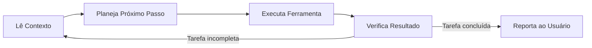

## Demonstração prática: instalação de skill

* Instalação via CLI universal: `npx skills add addyosmani/agent-skills --skill code-review-and-quality`
* Execução sobre base de código real para comparar a saída estruturada contra um prompt avulso.
* Avaliação da consistência dos critérios de segurança e legibilidade fornecidos pelo checklist da skill.

---

## Avaliação sistemática de skills

* Executar o mesmo conjunto de testes em múltiplas repetições com e sem a skill habilitada.
* Avaliar a taxa de cobertura de critérios e a consistência das saídas produzidas.
* Alterar uma única variável por teste (modelo ou skill) para isolar a causa de variações.
* Estabelecer os critérios de aceitação previamente à coleta das métricas.

---

## Riscos de ferramentas com execução

* Prompts que só geram texto operam em ambiente contido. Ferramentas com acesso a terminal, rede ou APIs ampliam a superfície de ataque.
* O caso mais explorado é prompt injection: instrução maliciosa colocada em conteúdo que o agente lê durante a tarefa e passa a seguir como se viesse do usuário.
* Uma carga embutida em página pública ou documento compartilhado atinge qualquer agente que a processe. O dano é maior quando o agente tem acesso a dados privados e permissão de ação ao mesmo tempo.

---

## Vetores de prompt injection

Injeção direta vem da entrada do usuário. Injeção indireta vem de conteúdo externo no contexto:

* Comentários, docstrings, README e fixtures do repositório.
* Páginas web e resultados de busca lidos pela navegação.
* Issues, pull requests e revisões em plataformas de código.
* E-mails e mensagens entregues ao agente para resumo.
* Saídas de ferramentas e respostas de servidores MCP.
* Logs de build e metadados de dependências.

---

## Defesa em camadas contra injeção

Nenhuma camada isolada zera o risco. O Claude Opus 5 combina três:

1. Treinamento do modelo para identificar e recusar instruções injetadas.
2. Sondas de entrada que inspecionam resultados de ferramentas antes de o modelo agir.
3. Classificador que bloqueia chamadas de ferramenta perigosas na saída.

As sondas agem sobre dados que entram, o classificador sobre ações que saem. O ataque precisa vencer as duas. No Claude Code, esse conjunto é chamado auto mode.

---

## Risco residual de prompt injection

Benchmarks estáticos de injeção estão saturados e produzem falsa sensação de segurança. Ataque que passa no benchmark costuma falhar contra variação nova.

No system card do Claude Opus 5, o benchmark IPI da Gray Swan mede a probabilidade de sucesso do atacante em 2,0% após 15 tentativas e 0,2% em 1 tentativa. Com sondas de injeção ativas, cai para 0,18%. Em navegador com auto mode, nenhum dos 129 cenários registrou ataque bem-sucedido.

As taxas residuais seguem acima de zero. A Anthropic trata prevenção de prompt injection como prioridade contínua de segurança.

---

## Resumo: engenharia de agentes

* System prompts, few-shot e schemas JSON estruturam as entradas e saídas de chamadas individuais.
* Regras fixam restrições invariantes do projeto, enquanto skills empacotam capacidades sob demanda.
* Tool Calling capacita o agente a interagir com o ambiente operacional sob controle da runtime.
* A inspeção crítica do código gerado permanece como responsabilidade técnica do engenheiro de software.

---

## Para estudar mais: skills e ferramentas

* Especificações de Tool Calling: [docs.claude.com](https://docs.claude.com/en/docs/agents-and-tools/tool-use/overview), [ai.google.dev](https://ai.google.dev/gemini-api/docs/function-calling) e [platform.openai.com](https://platform.openai.com/docs/guides/function-calling).
* Anthropic. *Writing effective tools for agents*: diretrizes para descrição de ferramentas consumidas por LLMs.
* Padrão aberto para instruções de agentes: [agents.md](https://agents.md).
* OWASP. *Top 10 for LLM Applications*: guia de vulnerabilidades em sistemas de IA (LLM01: Prompt Injection).
* Anthropic. *Claude Opus 5 System Card*, seção 5.2: robustez a prompt injection em agentes, benchmark IPI e defesa em camadas.
* Guias de arquitetura RAG: [ai.google.dev/gemini-api/docs/embeddings](https://ai.google.dev/gemini-api/docs/embeddings).

---

# Ferramentas CLI autônomas
## Ambientes de desenvolvimento e protocolos

---

## Modos de operação: autocomplete e agentes

| Característica | Autocomplete tradicional | Agente autônomo |
|---|---|---|
| Escopo de atuação | Sugestão linha a linha | Execução de tarefas completas |
| Tomada de decisão | Desenvolvedor aceita sugestão | Agente planeja e executa em loop |
| Acesso ao ambiente | Restrito ao buffer do editor | Lê arquivos, executa testes e comandos |

Exemplos de ferramentas com suporte a agentes: Claude Code, Cursor em modo Agent e Antigravity.

---

## Ciclo de execução de um agente

O ciclo iterativo permite ao agente investigar erros, ajustar o código e validar a solução antes de finalizar a interação.

---

## Etapas do ciclo de execução

1. O agente reúne o objetivo, o histórico da conversa, os arquivos abertos e a saída das ferramentas anteriores. As regras de `AGENTS.md` entram sem gatilho manual.
2. O modelo escolhe uma única ação, com ferramenta e argumentos. Cada volta do loop decide o passo seguinte, o plano não é fixado de uma vez.
3. A runtime executa a operação com `view_file`, `run_command` ou `replace_file_content`, aplica as permissões e devolve o `tool_result`.
4. O modelo lê o `tool_result` e decide entre encerrar o loop ou voltar ao passo 1. Sem essa conferência, o agente empilha correções sobre estado que não inspecionou.

---

## Depuração técnica de código gerado

* O ciclo do agente inclui uma etapa explícita de verificação. A conferência humana deve manter o mesmo rigor.
* Desenvolvedores devem exercitar a análise de código e o rastreamento manual de falhas para preservar a capacidade técnica de depuração.
* Ao identificar inconsistências em saídas de IA, isole o erro no depurador antes de solicitar nova geração.

---

## Panorama de ferramentas de mercado

* **Claude Code:** CLI voltada para operações no terminal com suporte a refatorações complexas em todo o repositório.
* **Cursor:** ambiente de desenvolvimento integrado com suporte a modos de edição inline e agentes autônomos.
* **GitHub Copilot:** integração com o ecossistema GitHub, cobrindo sugestões inline e modos de chat com contexto do projeto.
* **Antigravity:** plataforma de IA da Google para auxiliar na codificação, oferecendo sugestões, completação e análise de código. Possui IDE e CLI.
* **Muse:** CLI da Meta para auxiliar na codificação, oferecendo sugestões, completação e análise de código.

---

## Gestão de permissões e isolamento

* Ferramentas seguras exigem confirmação prévia para ações irreversíveis: exclusão de arquivos, commits e chamadas de rede.
* O controle de permissões atua como mecanismo de contenção de risco em operações automatizadas.
* Ambientes de execução irrestrita devem ser utilizados exclusivamente em contêineres e sandboxes isolados.
