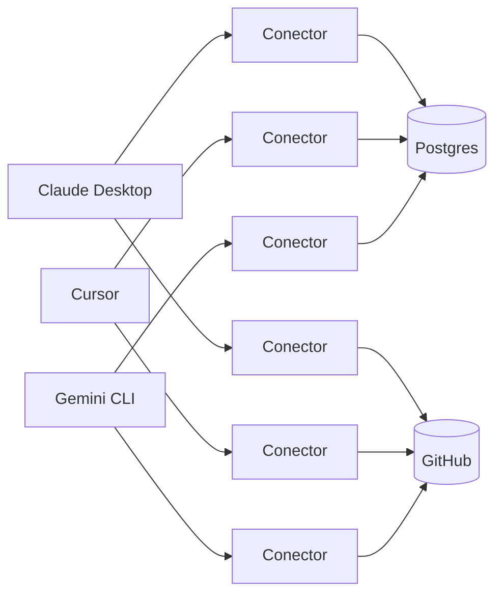
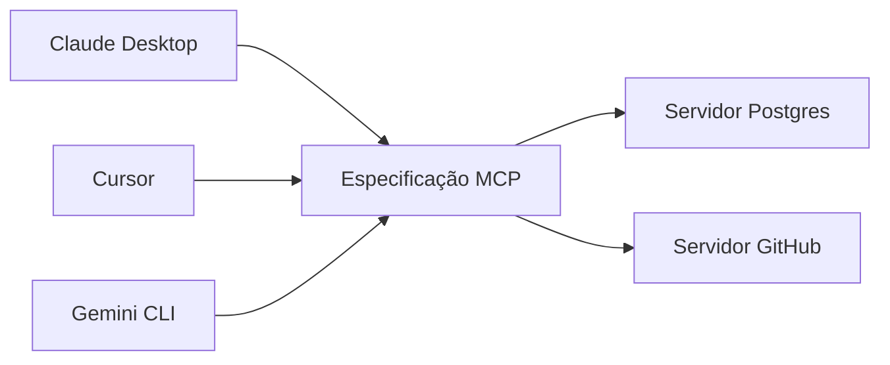
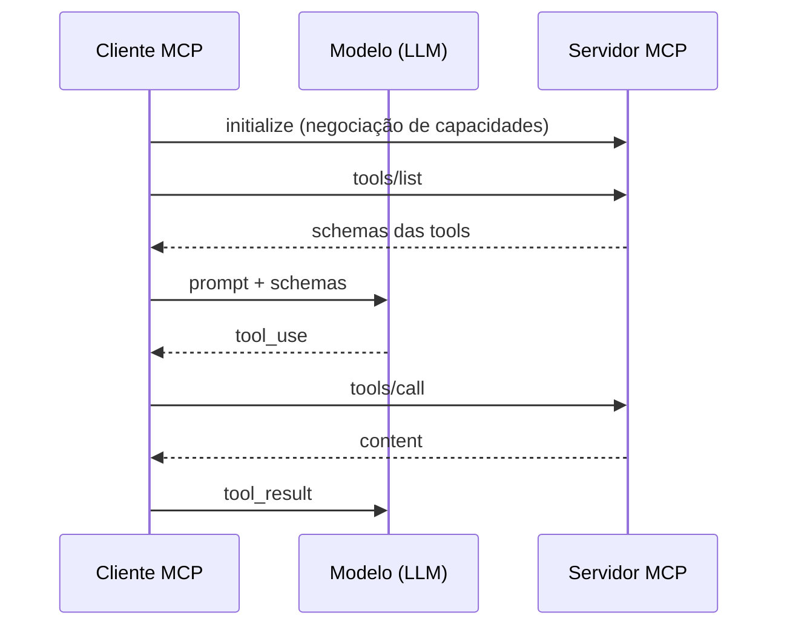

## Protocolo MCP

* Padrão aberto que liga um cliente de IA a servidores que expõem dados e operações, sobre JSON-RPC 2.0.
* Um servidor implementa a especificação uma vez e passa a funcionar em qualquer cliente compatível.
* Exemplos de servidores: bancos relacionais, busca de documentação atualizada, monitoramento e sistema de arquivos.

---

## Integrações antes do MCP



Cada seta é um conector escrito à mão, com autenticação e formato de erro próprios. Três clientes e duas fontes geram seis conectores.

---

## Integrações com o protocolo MCP



Cada cliente e cada servidor implementam a especificação uma vez e conversam ponto a ponto, sem servidor central. Três clientes e duas fontes somam cinco implementações.

---

## O que um servidor MCP expõe

| Primitivo | Conteúdo | Quem aciona |
|---|---|---|
| Tools | operação com schema de entrada, como consultar uma API | o modelo |
| Resources | conteúdo endereçado por URI que entra no contexto | o cliente |
| Prompts | instrução parametrizada entregue pronta | o usuário |

O servidor anuncia na inicialização quais desses primitivos oferece.

---

## Definição de uma tool no MCP

Mesma estrutura do schema preenchido à mão na atividade de Tool Calling.

```json
{
  "name": "buscarPokemon",
  "description": "Busca um pokémon por nome ou número",
  "inputSchema": {
    "type": "object",
    "properties": { "nomeOuNumero": { "type": "string" } },
    "required": ["nomeOuNumero"]
  }
}
```

A `description` é lida pelo modelo e decide quando a tool é chamada.

---

## Ciclo de uma chamada por MCP



O lado do modelo segue idêntico ao do ciclo de Tool Calling. A execução da função e a devolução do resultado passam a atravessar o transporte até o servidor.

---

## Transporte e log do servidor

* `stdio` para servidor local executado como subprocesso, com JSON-RPC na entrada e saída padrão.
* Streamable HTTP para servidor remoto, num endpoint único que abre stream sob demanda.
* O envelope JSON-RPC é o mesmo nos dois. O transporte muda só o caminho dos bytes.
* O log do servidor vai para `stderr`, porque `stdout` pertence ao protocolo.

As revisões são identificadas pela data da última quebra, de `2024-11-05` à corrente `2026-07-28`.

---

## Riscos de usar servidores MCP

* A `description` de cada tool entra no contexto do modelo. Servidor comprometido injeta instrução que o agente executa.
* O protocolo não define autorização por operação. O controle de acesso fica no cliente, com as confirmações do bloco anterior.
* Cada servidor conectado injeta o schema de todas as suas tools na janela, antes de qualquer trabalho.
* Servidores comunitários rodam com as permissões do usuário e a maioria não passa por auditoria.

---

## MCP e ferramentas de linha de comando

| Critério | Servidor MCP | Ferramenta CLI |
|---|---|---|
| Contexto ocioso | Schema de todas as tools na inicialização | Nada até a primeira chamada |
| Volume de saída | Resultado volta inteiro ao contexto | `grep` e `jq` cortam antes de entrar |
| Composição | Uma tool por chamada | Pipeline resolve várias etapas |
| Quando compensa | Reuso entre clientes, saída estruturada | CLI madura já existe, tarefa pontual |

---

## Tool com preço consultado na hora

```ts
servidor.registerTool('custoDaChamada', {
  description: 'Custo de uma chamada, com preço do momento.',
  inputSchema: {
    modelo: z.string().min(2),
    tokensEntrada: z.number().int().min(0),
    tokensSaida: z.number().int().min(0)
  }
}, custoDaChamada)
```

Preço de provedor muda sem aviso, então nada fica gravado no código. Na primeira tool de preço do processo o servidor busca o catálogo público (2,55 MB) e guarda em memória por 6 horas. O contexto recebe só as linhas do modelo pedido.

---

## Resource e prompt no mesmo servidor

```ts
servidor.registerResource('conteudo-b1', 'b1://conteudo', {
  mimeType: 'text/markdown'
}, lerConteudo)

servidor.registerPrompt('revisar-para-prova', {
  argsSchema: { topico: z.string().min(3) }
}, revisarParaProva)
```

O resource devolve o índice da B1 com o link de cada slide da turma. O prompt monta a revisão e manda o modelo usar a tool de busca.

---

## Para estudar mais: ferramentas e protocolos

* Especificação técnica do MCP: [modelcontextprotocol.io](https://modelcontextprotocol.io).
* Anthropic. *Code execution with MCP*: padrão que reduz o custo de tokens das definições de tools.
* Documentação técnica dos ambientes: [docs.claude.com/claude-code](https://docs.claude.com/en/docs/claude-code/overview), [docs.cursor.com](https://docs.cursor.com) e [code.visualstudio.com/docs/copilot](https://code.visualstudio.com/docs/copilot/overview).
* Repositório de agente de terminal em código aberto: [github.com/google-gemini/gemini-cli](https://github.com/google-gemini/gemini-cli).
* DORA Report. *State of AI-assisted Software Development*, 2025.
